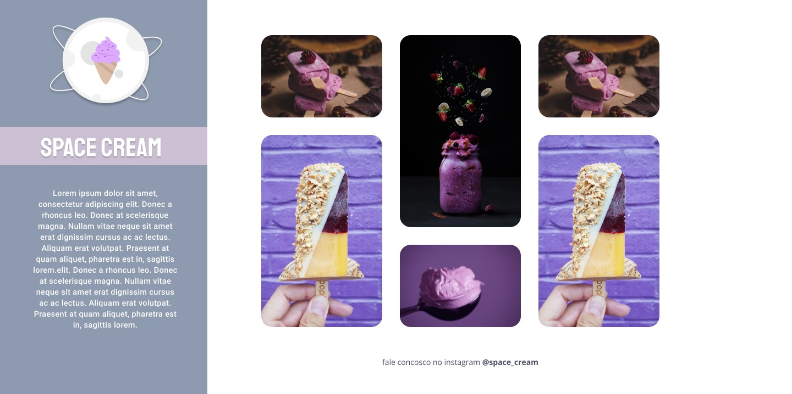

<h1 align="center"> Space Cream </h1>

Repositório do desafio mobile first do stage 03 da turma 09 do explorer, o objetivo era criar uma página de sorvetes, levando em consideração o Mobile first!  

  <a href="#technologies">Technologies</a>&nbsp;&nbsp;&nbsp;|&nbsp;&nbsp;&nbsp;
  <a href="#project">Project</a>&nbsp;&nbsp;&nbsp;|&nbsp;&nbsp;&nbsp;
  <a href="#layout">Layout</a>

 

  

## 🚀 Technologies

Esse projeto foi desenvolvido com as seguintes tecnologias:

- HTML e CSS
- Git e Github
- Figma

## 💻 Project

O projeto consiste em uma página de divulgação de uma loja de sorvetescremes.

- [Visite o projeto online](https://spacecream-raulrodmo.netlify.app/)

## 🔖 Layout

Você pode visualizar o layout do projeto através [DESSE LINK](https://www.figma.com/file/pddZCuQIRLjk5dEHQ4L4YR/Stage-03---Grid-com-anima%C3%A7%C3%B5es/duplicate). É necessário ter conta no [Figma](https://figma.com) para acessá-lo.

---

Made with 💜 by raulrodmo

